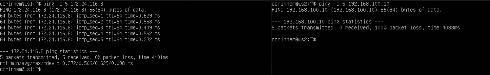
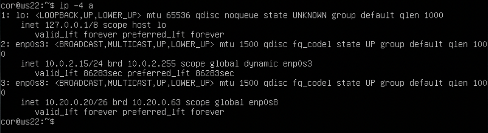
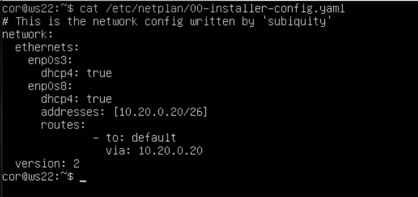
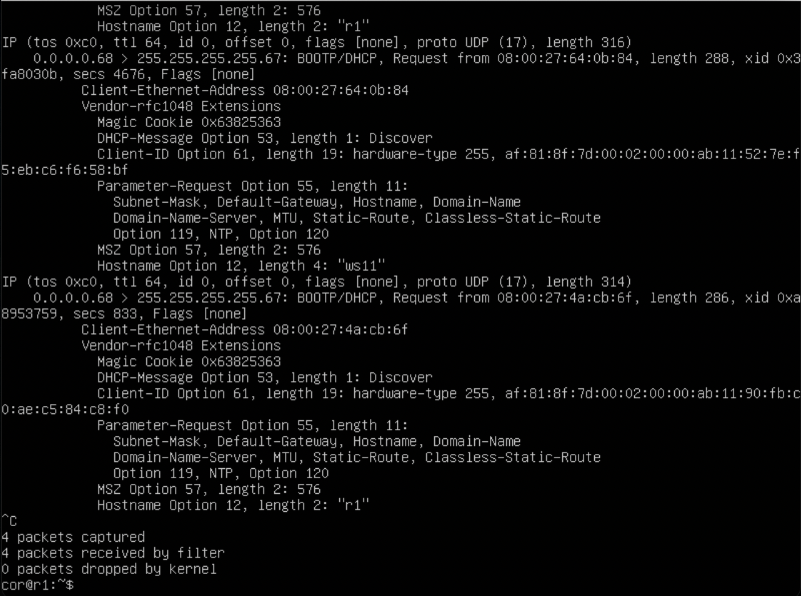

# Отчет
## Part 1. Инструмент ipcalc
### 1.1. Сети и маски
- Адрес сети:\

- Перевод 255.255.255.0:
    - Прифексная: /24
    - Двоичная: 11111111.11111111.11111111.00000000
- Перевод /15:
    - Обычная: 255.254.0.0
    - Двоичная: 11111111.11111110.00000000.00000000
- Перевод 11111111.11111111.11111111.11110000:
    - Обычная: 255.255.255.240
    - Прифексная: /28
- HostMin:
    - /8: 12.0.0.1
    - 1111111.11111111.00000000.00000000: 12.167.0.1
    - 255.255.254.0: 12.167.38.1
    - /4: 0.0.0.1
- HostMax:
    - /8: 12.255.255.254
    - 1111111.11111111.00000000.00000000: 12.167.255.254
    - 255.255.254.0: 12.167.39.254
    - /4: 15.255.255.254

### 1.2. localhost
- Обращение к ip:\

### 1.3. Диапазоны и сегменты сетей
- Всего три диапазона приватных адресов:
    - 10.0.0.0/8 (то есть всё что начинается на 10.);
    - 172.16.0.0/12 (то есть с 172.16.0.0 по 172.31.255.255 включительно);
    - 192.168.0.0/16 (то есть со 192.168.0.0 по 192.168.255.255 включительно).
- Публичные:
    - 134.43.0.2
    - 172.0.2.1
    - 192.172.0.1
    - 172.68.0.2
    - 192.169.168.1
- Приватные:
    - 10.0.0.45
    - 192.168.4.2
    - 172.20.250.4
    - 172.16.255.255
    - 10.10.10.10
- Возможные шлюза у сети 10.10.0.0/18:
    - 10.10.0.2
    - 10.10.10.10
    - 10.10.1.255

## Part 2. Статическая маршрутизация между двумя машинами
- Сетевые интерфейсы:\

- Описание сетевых интерфейсов:
    - ws1:\
    
    - ws2:\
    
- Выполнение команды `netplan apply`:\

### 2.1. Добавление статического маршрута вручную
- Пинговка:\

### 2.2. Добавление статического маршрута с сохранением
- Добавление статического маршрута:\

- Пинговка:\

## Part 3. Утилита iperf3
### 3.1. Скорость соединения
- Перевод:
    - 8 Mbps = 1 MB/s
    - 100 MB/s = 100000 Kbps
    - 1 Gbps = 1000 Mbps
### 3.2. Утилита iperf3
- Скорость соединения:\

## Part 4. Сетевой экран
### 4.1. Утилита iptables
- Содержание файла /etc/firewall.sh:\

- Запуск файлов:\

Разница в том, что в первом файле первым правилом для пакета - запрет, а во втором - разрешение. Применяется только первое правило, остальные игнорируются.
### 4.2. Утилита nmap
- Пинговка:\

- Вызов команды `nmap`:\

## Part 5. Статическая маршрутизация сети
### 5.1. Настройка адресов машин
- ws11:\

- ws21:\

- ws22:\

- r1:\

- r2:\

- Вызов команды `ip -4 a`:
    - ws11:\
    
    - ws21:\
    
    - ws22:\
    
    - r1:\
    
    - r2:\
    
- Пинговка:
    - ws21 -> ws22:\
    
    - ws11 -> r1:\
    
### 5.2. Включение переадресации IP-адресов
- Вызов команды `sysctl -w net.ipv4.ip_forward=1`:
    - r1:\
    
    - r2:\
    
- Содержание файла sysctl.conf:
    - r1:\
    
    - r2:\
    
### 5.3. Установка маршрута по-умолчанию
- Содержание файла 00-installer-config.yaml:
    - ws11:\
    
    - ws21:\
    
    - ws22:\
    
- Вызов команды `ip r`:
    - ws11:\
    
    - ws21:\
    
    - ws22:\
    
- Пинговка ws11 -> r2:\

- Вызов команды `tcpdump -tn -i`:\

### 5.4. Добавление статических маршрутов
- Содержание файла 00-installer-config.yaml:
    - r1:\
    
    - r2:\
    
- Вызов команды `ip r`:
    - r1:\
    
    - r2:\
    
- Вызов команд `ip r list 10.10.0.0/18` и `ip r list 0.0.0.0/0` на ws11:\

Маршрут по умолчанию имеет более низкий приоритет и срабатывает, когда не найден подходящий маршрут в таблице маршрутизации. 0.0.0.0/0 - это немаршрутизируемый адрес, который можно использовать в разных целях, в основном, в качестве адреса по умолчанию или адреса-заполнителя. Маршрут по умолчанию имеет более низкий приоритет и срабатывает, когда не найден подходящий маршрут в таблице маршрутизации. Для сети 10.10.0.0 мы создали правило, соответственно используется созданный маршрут. Также можно устанавливать метрику, чтобы менять приоритеты маршрутов.
### 5.5. Построение списка маршрутизаторов
- Вызов команды `tcpdump -tnv -i` на r1:\

- Вызов команды `traceroute` от ws11 до ws21:\

Принцип работы traceroute: Утилита отправляет целевому узлу несколько пакетов с временем жизни 1 (TTL, time to live - число переходов, которые пакет может осуществить до своего исчезновения). Следующий маршрутизатор принимает пакеты и отправляет сообщение, что время жизни пакетов истекло. traceroute фиксирует адрес этого маршрутизатора и отправляет следующие пакеты, уже с TTL 2. Так, каждый раз увеличивая TTL на 1, traceroute составляет список маршрутизаторов, через которе прошли пакеты до целевого узла. Для определения промежуточных маршрутизаторов traceroute отправляет серию пакетов данных целевому узлу, при этом каждый раз увеличивая на 1 значение поля TTL («время жизни»). Это поле обычно указывает максимальное количество маршрутизаторов, которое может быть пройдено пакетом. Первый пакет отправляется с TTL, равным 1, и поэтому первый же маршрутизатор возвращает обратно сообщение ICMP, указывающее на невозможность доставки данных. Traceroute фиксирует адрес маршрутизатора, а также время между отправкой пакета и получением ответа (эти сведения выводятся на монитор компьютера). Затем traceroute повторяет отправку пакета, но уже с TTL, равным 2, что позволяет первому маршрутизатору пропустить пакет дальше.
### 5.6. Использование протокола ICMP при маршрутизации
- Перехват сетевого трафика:\

- Пинговка несуществующего IP с ws11:\

## Part 6. Динамическая настройка IP с помощью DHCP
- Настройка файла /etc/dhcp/dhcpd.conf:\

- Содержание файла resolv.conf:\

- Вызов команды `systemctl restart isc-dhcp-server`:\

- Пинговка ws21 -> ws22:\

- MAC ws11:\

- Настройка файла /etc/dhcp/dhcpd.conf для r1:\

- До обновления ip ws21:\

- После обновления ip ws21:\

Команда sudo dhclient -r освобождает текущий адрес интерфейса enp0s8. Команда sudo dhclient задает новый адрес указанному интерфейсу.

## Part 7. NAT
- Содержание файла ports.conf:
    - ws22:\
    
    - r1:\
    
- Вызов команды `service apache2 start`:\

- Пинговка(не должно) r1 -> ws22:\

- Пинговка(должно) r1 -> ws22:\

- Содержание файла firewall.sh:

- Вызов команды `telnet`:\

## Part 8. Дополнительно. Знакомство с SSH Tunnels
- `ssh -L 5555:localhost:80 10.20.0.20`:\

- `sudo telnet 127.0.0.1 8080`:\

- `ssh -R 5555:localhost:80 10.20.0.10` ws11:\

- `sudo telnet 127.0.0.1 8080` ws11:\
